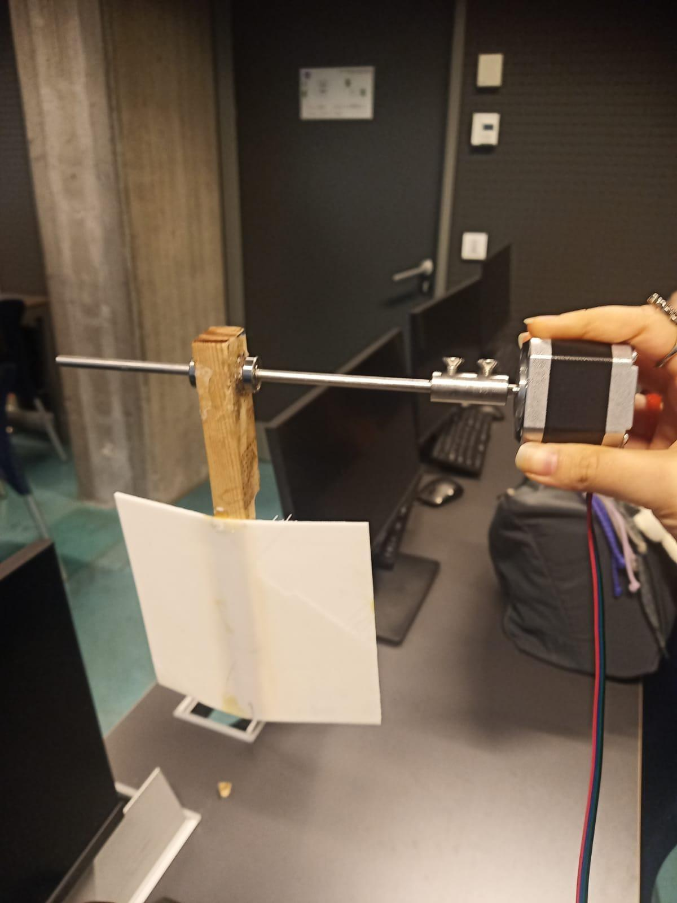

# Arduino-Based Wave Generation Mechanism

An Arduino-controlled electromechanical prototype that generates repeatable waves in a small water tank. A potentiometer adjusts the speed of a NEMA 17 stepper motor, whose rotary motion drives a paddle mechanism for laboratory-scale wave-energy experiments.

> This repository covers wave generation only. Direct electrical energy harvesting is outside the implemented scope.



## Features

- Real-time speed control with a 10 kΩ potentiometer
- NEMA 17 stepper motor control through an L298N driver
- Adjustable motor speed from 5 to 80 RPM
- Continuous, repeatable single-direction motion
- Compact platform for small-scale wave and buoy experiments

## System Overview

The Arduino reads the potentiometer through analog input `A0`, maps the value to a motor-speed range, and drives the four L298N input channels through the Arduino `Stepper` library. The motor transfers rotation to the paddle through a shaft and coupling, producing waves in the tank.

## Hardware

| Component | Quantity | Purpose |
|---|---:|---|
| Arduino Uno | 1 | Main controller |
| NEMA 17 stepper motor, 12 V / 2 A | 1 | Mechanical actuator |
| L298N motor driver | 1 | Stepper motor drive stage |
| 10 kΩ potentiometer | 1 | Manual speed control |
| Breadboard | 1 | Prototyping connections |
| Male-to-male jumper wires | 15 | Electrical connections |
| Motor coupling and bolts | 1 set | Motor-to-shaft connection |
| 2 mm shaft | 1 | Transfers motion to the paddle |
| Bearings | 2 | Supports the shaft |
| Power source | 1 | Supplies the prototype |

A detailed bill of materials is available in [hardware/bill_of_materials.md](hardware/bill_of_materials.md).

## Pin Connections

| Signal | Arduino pin | Description |
|---|---|---|
| Potentiometer output | `A0` | Analog speed input |
| L298N `IN1` | `D1` | Stepper phase control |
| L298N `IN2` | `D2` | Stepper phase control |
| L298N `IN3` | `D3` | Stepper phase control |
| L298N `IN4` | `D4` | Stepper phase control |

> **Pin note:** `D1` is also the Arduino Uno serial TX pin. The documented prototype used pins `D1-D4`, but remapping the motor inputs to four other digital pins is recommended if serial communication or upload conflicts occur. Update both the wiring and the `Stepper` constructor together.

## Software Requirements

- Arduino IDE 2.x or Arduino CLI
- Arduino AVR Boards package
- `Stepper` library, included with the standard Arduino core

No third-party software library is required.

## Installation and Use

1. Assemble the circuit according to the verified physical wiring.
2. Connect the motor to the L298N driver and use an appropriate external motor supply.
3. Open [`src/wave_generator.ino`](src/wave_generator.ino) in the Arduino IDE.
4. Select **Arduino Uno** and the correct serial port.
5. Upload the sketch.
6. Power the motor stage and turn the potentiometer to adjust the wave frequency.

Do not power a 12 V stepper motor directly from the Arduino 5 V pin. Ensure that the Arduino and motor driver share a common ground, keep electronics away from water, and disconnect power before changing wiring.

## Project Structure

```text
.
├── docs/
│   └── project_report.pdf
├── hardware/
│   ├── schematics/
│   │   └── README.md
│   └── bill_of_materials.md
├── media/
│   ├── electronics_setup.jpg
│   └── mechanical_prototype.jpg
├── src/
│   └── wave_generator.ino
├── .gitignore
└── README.md
```

## Testing

The prototype was evaluated by varying the potentiometer position and observing motor speed, continuity of paddle motion, and wave stability in the tank. The report describes functional, integration, system, and user-level observations. Quantitative measurements of wave height, frequency, power, and efficiency were not recorded and remain future work.

## Known Limitations

- The current control is open loop; motor position and wave height are not measured.
- The L298N does not provide the current regulation commonly used for NEMA 17 motors.
- The prototype does not yet measure generated electrical power.
- A verified, repository-ready wiring schematic is still needed.

## Future Work

- Add a current-regulated stepper driver and document its current limit.
- Measure wave frequency and height with sensors.
- Add end stops and an emergency-stop control.
- Integrate a buoy-based generator and record voltage, current, and power.
- Compare commanded motor speed with measured wave characteristics.

## Authors and Contributions

- **Yaprak Ağırman** — firmware development, material procurement, and mechanical design
- **Samet Erdoğan** — hardware preparation, material procurement, and mechanical design

GitHub and LinkedIn profile links will be added after both authors' account details are confirmed.

## Documentation

The academic project report is available in [`docs/project_report.pdf`](docs/project_report.pdf). Student identification numbers have been removed from the public repository copy.

## License

No license has been selected yet. Until both authors approve a license, copyright remains with the contributors and reuse is not automatically granted.
