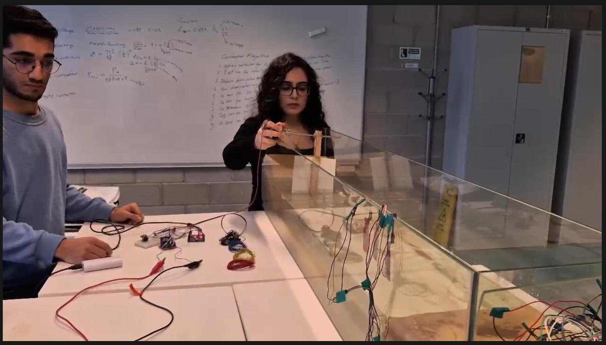

# Arduino Tabanlı Dalga Üretim Mekanizması

Küçük bir su tankında tekrarlanabilir dalgalar üreten, Arduino kontrollü elektromekanik bir prototiptir. Potansiyometre ile NEMA 17 step motorun hızı ayarlanır; motorun dönme hareketi, laboratuvar ölçekli dalga enerjisi deneyleri için bir palet mekanizmasını çalıştırır.

> Bu depo yalnızca dalga üretimini kapsamaktadır. Elektrik enerjisinin doğrudan elde edilmesi, uygulanan proje kapsamının dışındadır.


## Proje Ekibi



*Yaprak Ağırman ve Samet Erdoğan, dalga üretim mekanizmasının montajı ve testleri sırasında.*

## Özellikler

- 10 kΩ potansiyometre ile gerçek zamanlı hız kontrolü
- L298N sürücüsü üzerinden NEMA 17 step motor kontrolü
- 5–80 RPM arasında ayarlanabilir motor hızı
- Sürekli, tekrarlanabilir ve tek yönlü hareket
- Küçük ölçekli dalga ve şamandıra deneyleri için kompakt platform

## Sistem Genel Bakışı

Arduino, potansiyometre değerini `A0` analog girişinden okur, bu değeri motor hız aralığına dönüştürür ve Arduino `Stepper` kütüphanesi aracılığıyla L298N sürücüsünün dört giriş kanalını kontrol eder. Motor, dönme hareketini bir mil ve kaplin üzerinden palete aktararak tankta dalgalar oluşturur.

## Donanım

| Bileşen | Adet | Kullanım amacı |
|---|---:|---|
| Arduino Uno | 1 | Ana kontrol birimi |
| NEMA 17 step motor, 12 V / 2 A | 1 | Mekanik hareket sağlayıcı |
| L298N motor sürücüsü | 1 | Step motor sürme aşaması |
| 10 kΩ potansiyometre | 1 | Manuel hız kontrolü |
| Breadboard | 1 | Prototip devre bağlantıları |
| Erkek-erkek jumper kablo | 15 | Elektrik bağlantıları |
| Motor kaplini ve cıvatalar | 1 set | Motor-mil bağlantısı |
| 2 mm mil | 1 | Hareketi palete aktarır |
| Rulman | 2 | Mili destekler |
| Güç kaynağı | 1 | Prototipe güç sağlar |

Ayrıntılı malzeme listesine [hardware/bill_of_materials.md](hardware/bill_of_materials.md) dosyasından ulaşabilirsiniz.

## Pin Bağlantıları

| Sinyal | Arduino pini | Açıklama |
|---|---|---|
| Potansiyometre çıkışı | `A0` | Analog hız girişi |
| L298N `IN1` | `D1` | Step motor faz kontrolü |
| L298N `IN2` | `D2` | Step motor faz kontrolü |
| L298N `IN3` | `D3` | Step motor faz kontrolü |
| L298N `IN4` | `D4` | Step motor faz kontrolü |

> **Pin notu:** `D1`, aynı zamanda Arduino Uno'nun seri TX pinidir. Belgelenen prototipte `D1-D4` pinleri kullanılmıştır; ancak seri iletişim veya kod yükleme çakışmaları yaşanırsa motor girişlerinin başka dört dijital pine atanması önerilir. Bu durumda hem fiziksel bağlantılar hem de `Stepper` kurucu fonksiyonu birlikte güncellenmelidir.

## Yazılım Gereksinimleri

- Arduino IDE 2.x veya Arduino CLI
- Arduino AVR Boards paketi
- Standart Arduino çekirdeğine dahil olan `Stepper` kütüphanesi

Herhangi bir üçüncü taraf yazılım kütüphanesi gerekli değildir.

## Kurulum ve Kullanım

1. Devreyi doğrulanmış fiziksel bağlantılara göre kurun.
2. Motoru L298N sürücüsüne bağlayın ve uygun bir harici motor güç kaynağı kullanın.
3. Arduino IDE'de [`src/wave_generator.ino`](src/wave_generator.ino) dosyasını açın.
4. **Arduino Uno** kartını ve doğru seri portu seçin.
5. Kodu karta yükleyin.
6. Motor sürücü katmanına güç verin ve dalga frekansını ayarlamak için potansiyometreyi çevirin.

12 V step motoru doğrudan Arduino'nun 5 V pininden beslemeyin. Arduino ile motor sürücüsünün ortak toprağa bağlı olduğundan emin olun, elektronik bileşenleri sudan uzak tutun ve bağlantıları değiştirmeden önce gücü kesin.

## Proje Yapısı

```text
.
├── docs/
│   └── project_report.pdf
├── hardware/
│   ├── schematics/
│   │   └── README.md
│   └── bill_of_materials.md
├── media/
│   ├── electronics_setup.jpg
│   └── mechanical_prototype.jpg
├── src/
│   └── wave_generator.ino
├── .gitignore
└── README.md
```

## Testler

Prototip; potansiyometre konumu değiştirilerek motor hızı, palet hareketinin sürekliliği ve tanktaki dalga kararlılığı gözlemlenerek değerlendirilmiştir. Raporda fonksiyonel, entegrasyon, sistem ve kullanıcı düzeyindeki gözlemler açıklanmaktadır. Dalga yüksekliği, frekans, güç ve verimlilik için nicel ölçümler kaydedilmemiştir ve bunlar gelecekte yapılacak çalışmalar kapsamında ele alınacaktır.

## Bilinen Sınırlamalar

- Mevcut kontrol sistemi açık çevrimlidir; motor konumu ve dalga yüksekliği ölçülmemektedir.
- L298N, NEMA 17 motorlarda yaygın olarak kullanılan akım düzenleme özelliğini sağlamaz.
- Prototip henüz üretilen elektrik gücünü ölçmemektedir.
- Doğrulanmış ve depoda yayımlanmaya hazır bir bağlantı şeması hâlâ gereklidir.

## Gelecek Çalışmalar

- Akım kontrollü bir step motor sürücüsü eklemek ve akım sınırını belgelemek.
- Sensörlerle dalga frekansını ve yüksekliğini ölçmek.
- Sınır anahtarları ve acil durdurma kontrolü eklemek.
- Şamandıra tabanlı bir jeneratör entegre ederek gerilim, akım ve güç değerlerini kaydetmek.
- Komut verilen motor hızını ölçülen dalga özellikleriyle karşılaştırmak.

## Yazarlar ve Katkılar

- **Yaprak Ağırman** — gömülü yazılım geliştirme, malzeme tedariki ve mekanik tasarım
- **Samet Erdoğan** — donanım hazırlığı, malzeme tedariki ve mekanik tasarım

Her iki yazarın hesap bilgileri doğrulandıktan sonra GitHub ve LinkedIn profil bağlantıları eklenecektir.

## Dokümantasyon

Akademik proje raporuna [`docs/project_report.pdf`](docs/project_report.pdf) dosyasından ulaşabilirsiniz. Öğrenci kimlik numaraları, herkese açık depo kopyasından kaldırılmıştır.

## Lisans

Henüz bir lisans seçilmemiştir. Her iki yazar da bir lisansı onaylayana kadar telif hakkı katkıda bulunanlara aittir ve yeniden kullanıma otomatik olarak izin verilmez.
